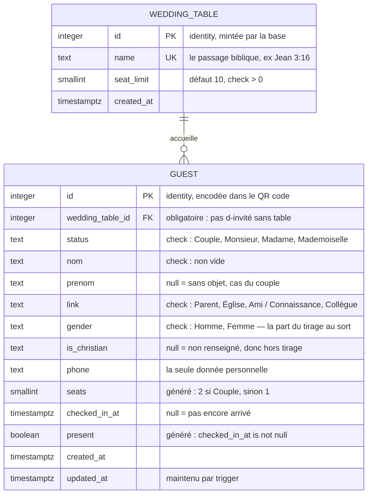

# Modèle de données

Diagramme de `schema.sql`. GitHub affiche le Mermaid ci-dessous directement ;
dans VS Code, l'extension « Markdown Preview Mermaid Support » fait la même
chose.

## Comment lire la cardinalité

`WEDDING_TABLE ||--o{ GUEST` se lit dans les deux sens :

- `||` du côté table — un invité appartient à **exactement une** table. La
  clé étrangère est `not null`, ce n'est donc pas une formule de politesse :
  la base refuse un invité sans table.
- `o{` du côté invité — une table accueille **zéro ou plusieurs** invités. Une
  table vide est normale, surtout en début de préparation.

## Ce que le diagramme ne montre pas

Trois règles vivent dans le schéma sans apparaître sur le dessin :

| Règle                                     | Où elle est tenue                |
| ----------------------------------------- | -------------------------------- |
| Un couple occupe deux couverts            | Colonne générée `guest.seats`    |
| « Présent » découle de l'heure d'arrivée  | Colonne générée `guest.present`  |
| Une table ne dépasse pas son `seat_limit` | Trigger `guest_enforce_capacity` |

La dernière est la seule qui ait besoin d'un trigger : elle dépend des autres
lignes de la même table, ce qu'une contrainte de colonne ne sait pas exprimer.
Le trigger verrouille la ligne `wedding_table` le temps du calcul, sinon le PC
et le téléphone peuvent prendre le dernier couvert au même instant.

## La vue `guest_public`

`schema-secure.sql` ajoute une vue — pas une entité, une projection de `GUEST`
sans `phone`, `is_christian`, ni les horodatages. C'est ce que lit un invité qui
scanne son QR code lorsque la variante verrouillée est en place. Elle joint
`wedding_table` pour exposer `table_name` directement, puisque le téléphone n'a
besoin que du nom de la table, jamais de son identifiant.

## Correspondance avec le modèle de l'application

Les noms diffèrent des deux côtés, pour des raisons qui ne disparaîtront pas :
`table` est un mot réservé en SQL, et Postgres met les identifiants non
échappés en minuscules. La traduction est isolée dans
`src/app/core/services/supabase-row.ts` et testée, parce qu'une correspondance
éparpillée dans les requêtes perd un champ à la première faute de frappe, sans
lever d'erreur.

| Base                                                   | Application                   |
| ------------------------------------------------------ | ----------------------------- |
| `wedding_table_id` → jointure sur `wedding_table.name` | `guest.table` (le nom)        |
| `is_christian`                                         | `guest.isChristian`           |
| `checked_in_at`                                        | écrit au pointage             |
| `present` (généré)                                     | `guest.present` (lu tel quel) |
